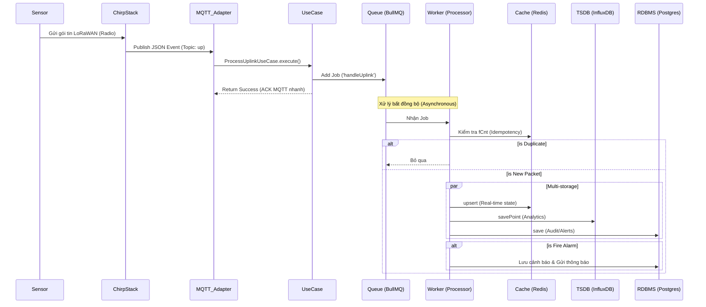
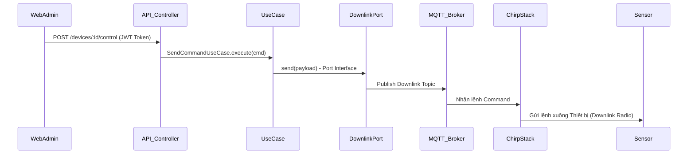

# 04. Quy trình Hệ thống (Workflows) - Updated Phase 2

Tài liệu này mô tả các workflow chính của nền tảng LoRaWAN Báo Cháy sau khi áp dụng hàng đợi xử lý.

## 1. Workflow xử lý sự kiện Uplink (Sensor -> Backend)

## 2. Workflow Điều khiển Thiết bị (API -> Sensor)

## 3. Workflow Kiểm tra Sức khỏe (Monitoring)

1. **Monitor/Admin**: Truy cập `GET /health`.
2. **HealthController**: 
   - Gọi `TypeOrmHealthIndicator` kiểm tra Postgres.
   - PING Redis qua `RedisService`.
3. **Response**: Trả về trạng thái `up/down` của từng dịch vụ kèm chi tiết (Payload chuẩn Terminus).
