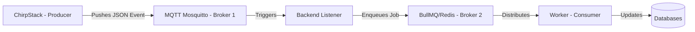

# Phân tích Kiến trúc Hướng sự kiện (Event-Driven Architecture - EDA)
Ngày cập nhật: 31/03/2026

Tài liệu này trình bày các khái niệm lý thuyết cốt lõi của EDA và cách chúng ta đã vận dụng một cách thực tế vào hệ thống LoRaWAN Platform hiện tại.

---

## 1. Lý thuyết Chung về EDA (Kiến trúc Hướng sự kiện)

Kiến trúc Hướng sự kiện là một mô hình thiết kế phần mềm trong đó các dịch vụ giao tiếp với nhau bằng cách bắt và phản ứng lại các "Sự kiện" (Events) thay vì gọi trực tiếp (Request/Response).

### Các thành phần chính của EDA:
- **Event Producer (Người tạo sự kiện)**: Nơi phát sinh ra dữ liệu (Vd: Thiết bị cảm biến gửi tin).
- **Event Broker (Người trung chuyển)**: Nơi lưu trữ và phân phối sự kiện (Vd: MQTT, BullMQ/Redis).
- **Event Consumer (Người tiêu thụ)**: Nơi thực hiện logic nghiệp vụ khi có sự kiện đến (Vd: Backend Worker).
- **Event (Sự kiện)**: Bản ghi dữ liệu chứa thông tin về một trạng thái thay đổi (Vd: "Nhiệt độ đã tăng lên 35 độ").

### Đặc điểm nổi bật của EDA:
1. **Tính Bất đồng bộ (Asynchronous)**: Producer gửi xong sự kiện là rảnh tay, không cần chờ Consumer xử lý xong.
2. **Tính Giảm ghép nối (Loose Coupling)**: Producer không cần biết Consumer là ai, nó chỉ cần đẩy tin vào Broker.
3. **Khả năng Mở rộng (Scalability)**: Có thể dễ dàng thêm hàng chục Consumer để xử lý một lượng lớn sự kiện cùng lúc.
4. **Tính Chịu lỗi (Fault Tolerance)**: Nếu Consumer bị sập, sự kiện vẫn nằm an toàn trên Broker (Hàng đợi) để chờ xử lý lại.

---

## 2. Vận dụng EDA vào Hệ thống LoRaWAN hiện tại

Dưới đây là cách chúng ta đã "hóa cứng" lý thuyết EDA vào mã nguồn của bạn:

### Sơ đồ luồng Sự kiện Thực tế:

### Chi tiết các thực thể trong bài làm:

- **Producer (ChirpStack)**: Đóng vai trò là nguồn phát sinh sự kiện. Khi Gateway đẩy tin từ Raspberry Pi 4 lên, ChirpStack giải mã và phát đi một "Sự kiện MQTT".
- **Broker (MQTT & BullMQ)**:
  - **MQTT**: Là cổng tiếp nhận sự kiện đầu tiên.
  - **BullMQ**: Là "kho chứa" sự kiện bền vững. Nó đảm bảo ngay cả khi Backend của bạn bị khởi động lại, các sự kiện từ cảm biến vẫn không bị mất.
- **Consumer (UplinkProcessor)**: Đây là Worker chuyên biệt. Nó chỉ "thức dậy" xử lý khi hàng đợi (Queue) có sự kiện mới.

### Những gì chúng ta đã Đạt được nhờ EDA:

1. **Xử lý Đột biến (Spike Handling)**:
   - Nếu 1.000 thiết bị cùng gửi tin trong 1 giây, EDA giúp Backend của bạn không bị "ngạt" (Choke). Các bản tin sẽ xếp hàng trật tự trong BullMQ và được Worker xử lý từ từ từng cái một.
2. **Tính Đúng đắn (Idempotency)**:
   - Nhờ EDA, chúng ta có thể kiểm tra từng sự kiện trước khi lưu. Thuật toán fCnt giúp chúng ta biết sự kiện này là "mới hoàn toàn" hay là "sự kiện lặp lại" để loại bỏ.
3. **Khả năng Phục hồi (DLQ)**:
   - Nếu một sự kiện gặp lỗi (Vd: InfluxDB bị lag), EDA cho phép chúng ta "đóng băng" sự kiện đó lại để chạy lại (Replay) sau mà không ảnh hưởng đến các sự kiện mới khác đang đến.

---

### Kết luận
Hệ thống của bạn hiện nay là một bản mẫu điển hình của **Kiến trúc EDA hiện đại**. Nó không chỉ chạy đúng logic mà còn mang trong mình khả năng chống chịu tải trọng (Resilience) cực tốt nhờ việc tách biệt hoàn toàn giữa việc **Nhận tin** và **Xử lý tin**.
