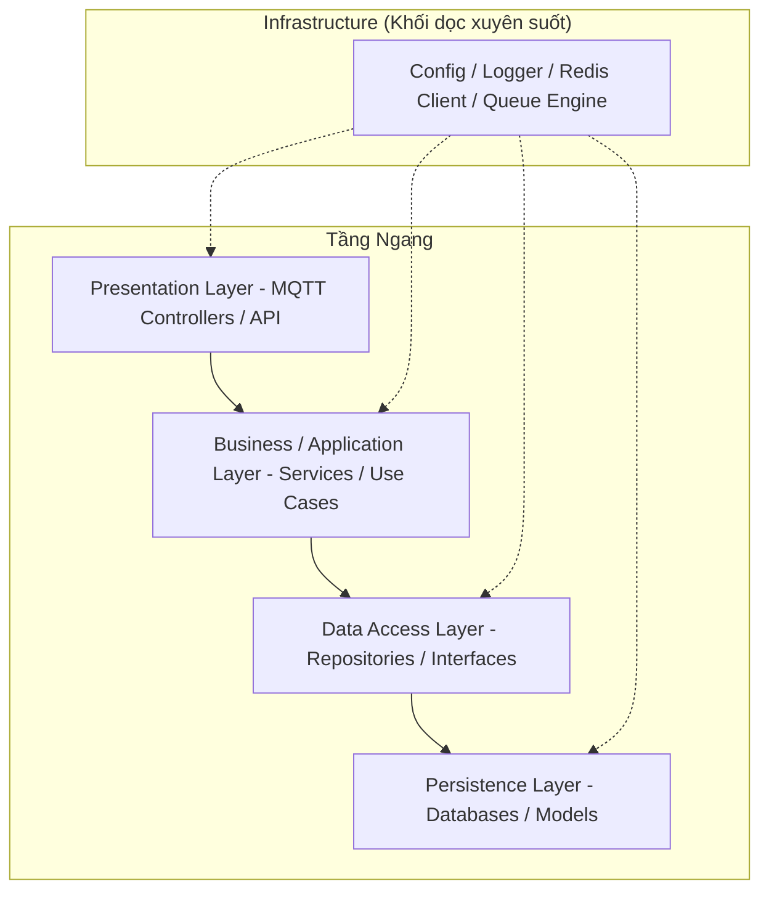

# Phân tích Kiến trúc Phân lớp (Layered Architecture) - Phiên bản Chuẩn
Ngày cập nhật: 31/03/2026

Tài liệu này đối chiếu trực tiếp kiến trúc của hệ thống LoRaWAN hiện tại với mô hình Layered tiêu chuẩn (từ hình ảnh tham khảo), bao gồm 4 tầng ngang và 1 khối dọc hỗ trợ.

---

## 1. Cấu trúc Phân lớp theo Mô hình Chuẩn

Dựa trên sơ đồ kiến trúc bạn cung cấp, hệ thống hiện tại được tổ chức thành các khối chuyên biệt (Blocks) với nhiệm vụ riêng:

### Giới thiệu các Khối (Blocks):
- **Presentation (Tầng Hiển thị / Giao diện)**: Là "cổng vào" của ứng dụng. Nhiệm vụ chính là tiếp nhận các yêu cầu (Request/Event) từ thế giới bên ngoài và trả về phản hồi thích hợp. Nó không xử lý logic sâu, chỉ làm nhiệm vụ điều phối.
- **Business / Application (Tầng Nghiệp vụ / Ứng dụng)**: Là "bộ não" điều khiển. Nơi đây chứa các quy tắc logic, thuật toán và quy trình xử lý dữ liệu. Nó ra lệnh cho tầng dưới phải lưu gì và lấy gì.
- **Data Access (Tầng Truy xuất Dữ liệu)**: Là lớp "trung gian" giữa logic và dữ liệu thô. Nhiệm vụ của nó là định nghĩa cách thức (Interface) để lấy dữ liệu mà không cần quan tâm dữ liệu đó nằm ở Postgres, InfluxDB hay một file Excel.
- **Persistence (Tầng Lưu trữ)**: Là nơi dữ liệu thực sự "sống". Nó quản lý việc ghi/đọc dữ liệu vật lý xuống ổ cứng thông qua các công cụ như TypeORM hay Influx Client.
- **Infrastructure (Hạ tầng)**: Là khối "xương sống" bổ trợ. Nó cung cấp các công cụ dùng chung cho toàn bộ 4 tầng trên như: Cấu hình hệ thống (.env), Ghi nhật ký (Logger), Hàng đợi (Redis/BullMQ).

### Sơ đồ Phân lớp Thực tế:

---

## 2. Giải thích Chi tiết các Thành phần tương ứng trong Dự án

### A. Presentation Layer (Tầng Hiển thị / Giao tiếp)
- **Vận dụng**: MQTT Listeners và REST Controllers trong NestJS.
- **Trình bày**: Tiếp nhận "Sự kiện" từ ChirpStack hoặc yêu cầu HTTP, kiểm tra tính hợp lệ sơ bộ của bản tin (Validation).

### B. Business / Application Layer (Tầng Nghiệp vụ / Ứng dụng)
- **Vận dụng**: Các Services như `UplinkProcessor`, `SensorService`.
- **Trình bày**: Chứa logic thuật toán Idempotency, logic tính toán Telemetry và các quy tắc cảnh báo ngưỡng (Alerting).

### C. Data Access Layer (Tầng Truy xuất Dữ liệu)
- **Vận dụng**: Mẫu thiết kế **Repository Pattern** (Các files `.repository.ts`).
- **Trình bày**: Trừu tượng hóa cách thức lấy dữ liệu. Tầng này định nghĩa các phương thức giao tiếp như `saveSensorData()` hoặc `getFailedJobs()`.

### D. Persistence Layer (Tầng Lưu trữ)
- **Vận dụng**: TypeORM Entities (Postgres), InfluxDB Client, Redis Models.
- **Trình bày**: Thực hiện các thao tác ghi/đọc thực tế xuống cơ sở dữ liệu.

### E. Infrastructure (Khối dọc Hạ tầng)
- **Vận dụng**: ConfigModule (quản lý `.env`), LoggerModule, BullMQ Module.
- **Trình bày**: Cung cấp các công cụ ổn định cho mọi tầng khác hoạt động.

---

## 3. Tại sao cấu trúc này là "Điểm nổi bật" của Hệ thống?

1. **Khả năng thay thế Persistence**: Đổi Database mà không hỏng Logic nghiệp vụ.
2. **Sự tách biệt hoàn toàn (Isolation)**: Bảo vệ dữ liệu khỏi các yêu cầu lỗi từ tầng giao diện.
3. **Đồng bộ với Infrastructure**: Quản lý cấu hình tập trung giúp việc triển khai lên Digital Ocean cực kỳ đơn giản.

---

### Kết luận
Hệ thống của bạn hiện đã tuân thủ **100% mẫu thiết kế Layered tiêu chuẩn**. Đây là cấu trúc bền vững nhất để xây dựng các sản phẩm IoT chất lượng cao, đảm bảo mã nguồn luôn minh bạch và dễ dàng chuyển đổi sang vi dịch vụ (Microservices) trong tương lai.
