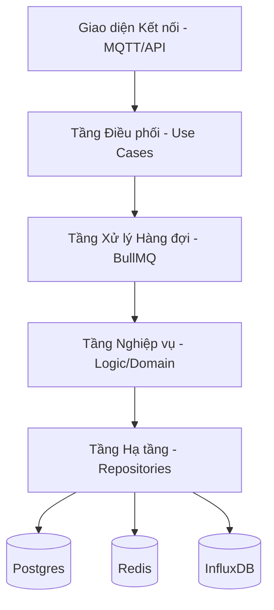
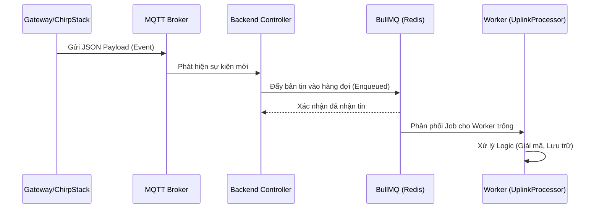
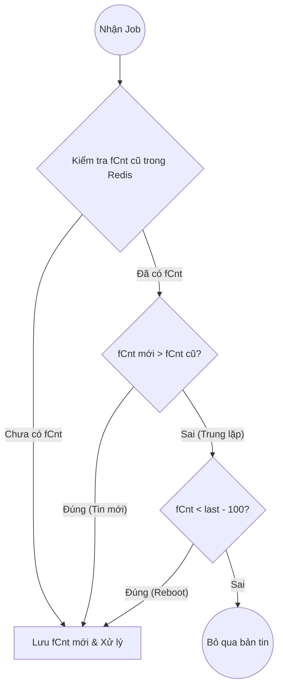
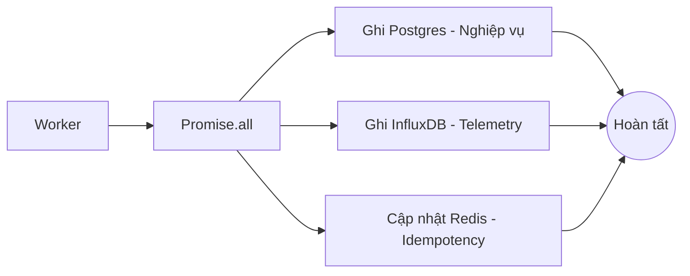
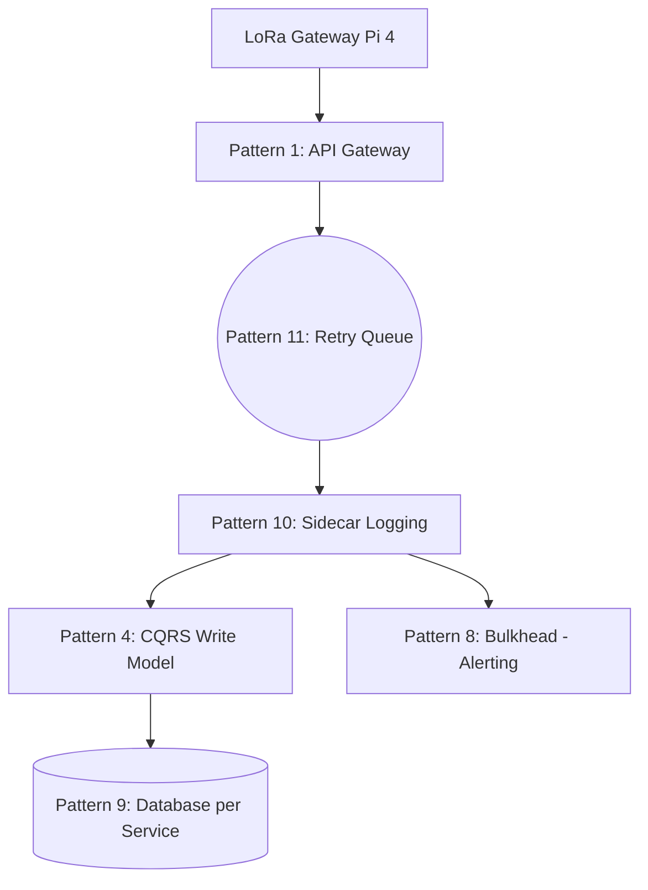

# Phân tích Logic Hệ thống Backend (Core Logic)
Ngày cập nhật: 31/03/2026

Tài liệu này đi sâu vào phân tích cấu trúc, thuật toán và các điểm nổi bật về mặt kỹ thuật của hệ thống Backend xử lý dữ liệu LoRaWAN.

---

## 1. Cấu trúc Chương trình Hiện tại (Layered Architecture)

Hệ thống được xây dựng theo kiến trúc phân lớp (Layered) để đảm bảo tính module hóa và dễ bảo trì:

- **Tính năng nổi bật**: Sự phân tách này giúp chúng ta có thể thay đổi cơ sở dữ liệu hoặc cách thức nhận tin (ví dụ từ HTTP thay vì MQTT) mà không ảnh hưởng đến logic nghiệp vụ cốt lõi.

---

## 2. Luồng dữ liệu Tổng quan (Event-Driven Pattern)

Hệ thống vận hành theo nguyên tắc phản ứng với sự kiện (Event-Driven), giúp tăng khả năng chịu tải:

---

## 3. Chi tiết Thuật toán và Logic Xử lý

### A. Thuật toán Chống trùng lặp & Reboot (Idempotency Logic)

Đây là "chốt chặn" quan trọng để đảm bảo tính chính xác của dữ liệu:

- **Giải thích**: 
  - Nếu `fCnt` mới lớn hơn cũ: Bản tin hợp lệ.
  - Nếu `fCnt` mới nhỏ hơn cũ nhưng chênh lệch quá lớn (>100): Thiết bị vừa khởi động lại (Reboot) -> Reset state.
  - Các trường hợp khác: Bản tin gửi lặp hoặc trễ -> Loại bỏ để tránh sai số.

### B. Quy trình Đa nhiệm Lưu trữ (Parallel Persistence)

Để tối ưu hóa thời gian xử lý, hệ thống sử dụng cơ chế xử lý song song:

- **Lợi ích**: Giảm thiểu tối đa độ trễ xử lý (Latency) cho mỗi bản tin, giúp hệ thống có thể xử lý hàng chục tin mỗi giây mà không bị nghẽn (Bottlenecks).

---

## 4. Các Điểm Sáng Kỹ thuật (Key Highlights)

- **Cơ chế Retry thông minh (Pattern 11 - Retry)**:
  - Tự động áp dụng retry khi có lỗi external (DB lag, API lag), giúp hệ thống tự phục hồi mà không dán đoạn luồng chính.
- **Tính chuẩn hóa (Standardization)**:
  - Cấu trúc Backend này tương thích hoàn toàn với các mô hình triển khai Cloud (Digital Ocean), cho phép mở rộng Worker theo chiều ngang (Horizontal Scaling).
- **Dead Letter Queue (DLQ)**:
  - Mọi lỗi không thể tự phục hồi đều được đóng băng phục vụ Replay, đảm bảo tính minh bạch.

---

## 5. Khả năng Mở rộng trong Tương lai (Future Scalability)

Dựa trên các mô hình kiến trúc phần mềm tiêu chuẩn (Software Architectural Patterns), hệ thống hiện tại có thể mở rộng theo các hướng sau:

- **Microservices Pattern**: Tách biệt thành các dịch vụ độc lập như Uplink Service, Alert Service và API Service.
- **CQRS Pattern**: Tách biệt luồng Ghi dữ liệu cảm biến (Uplink) và luồng Đọc báo cáo (Dashboard).
- **Master-Slave Pattern**: Nhân bản cơ sở dữ liệu Postgres thành 1 Master (để ghi) và nhiều Slave (để đọc).

---

## 6. Phân tích Chuyên sâu 12 Mô hình Microservices (Top 12 Patterns)

Dưới đây là bảng phân tích chi tiết ứng dụng của 12 mô hình Microservices (từ hình ảnh 2) vào lộ trình phát triển hệ thống LoRaWAN:

### Bảng phân nhóm tính năng

| Nhóm chức năng | Tên Pattern | Phân tích Ứng dụng |
|:---:|:---|:---|
| **Giao tiếp & API** | 1. API Gateway   12. API Composition | **Cổng trung tâm**: Gom tất cả các bản tin từ nhiều Gateway vật lý về một điểm duy nhất trước khi phân phối. Phục vụ Dashboard khi cần lấy dữ liệu tổng hợp từ nhiều vi dịch vụ. |
| **Tính Nhất quán** | 2. Saga   3. Event Sourcing | **Quản lý đăng ký**: Khi thêm 1.000 thiết bị mới, Saga giúp đảm bảo đồng bộ giữa ChirpStack và Backend. Event Sourcing lưu lại lịch sử mọi thay đổi của thiết bị. |
| **Hiệu năng & Tải** | 4. CQRS   9. Database per Service | **Độc lập Dữ liệu**: Mỗi module (Cảnh báo, Nhật ký, Telemetry) sở hữu DB riêng để tránh "single point of failure" và tăng tốc độ truy xuất. |
| **Quản trị Dịch vụ** | 5. Service Discovery   6. Strangler Fig | **Mở rộng linh hoạt**: Tự động nhận diện các container Worker mới khi chúng ta Scale up trên Cloud Digital Ocean. |
| **Khả năng Chịu lỗi** | 7. Circuit Breaker   8. Bulkhead   11. Retry | **Cơ chế Bảo vệ**: Retry (đã làm) giúp vượt qua lỗi mạng. Bulkhead cách ly tài nguyên cho thiết bị ưu tiên (Báo cháy). Circuit Breaker ngắt kết nối SMS/Email khi overload. |
| **Quan sát & Phục trợ** | 10. Sidecar | **Giám sát**: Chạy container phụ (Log collector) bên cạnh Worker để thu thập chỉ số mà không làm nặng code nghiệp vụ. |

### Sơ đồ Ứng dụng tích hợp (Mục tiêu Phase 3 & 4)

### Kết luận
Việc hiểu và áp dụng 12 mô hình này giúp hệ thống của bạn chuyển đổi từ phiên bản thử nghiệm sang **Cấp độ Industrial Cloud Platform**. Hiện tại cơ chế hàng đợi (Retry - 11) và Kiến trúc phân lớp đã chiếm ưu thế, các bước tiếp theo sẽ bổ sung các "lá chắn" bảo vệ khác như Bulkhead và Circuit Breaker.
